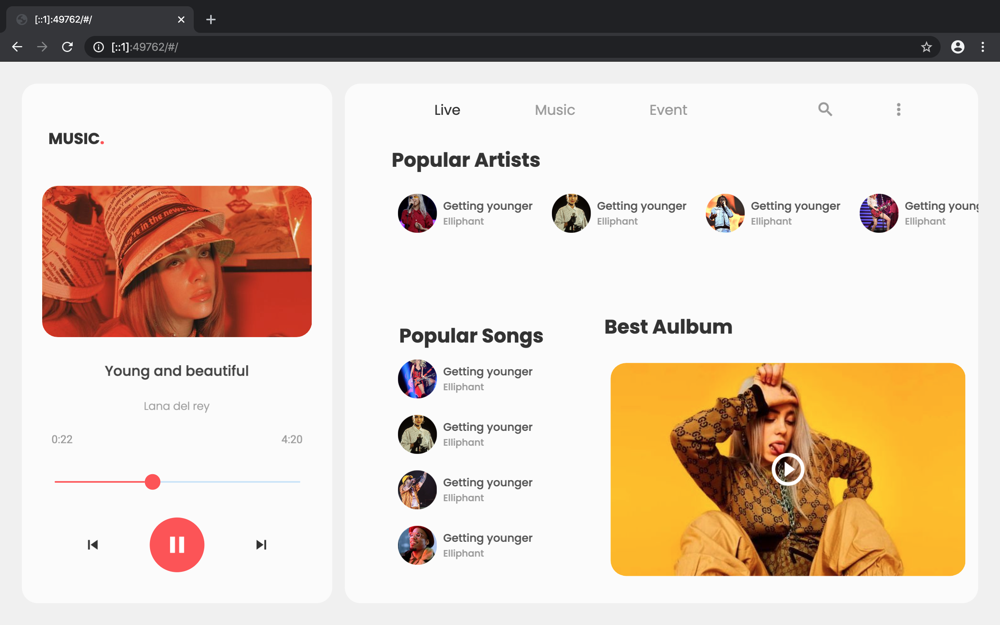

# Music UI Flutter Web.



## Web Set up
  Run the following commands to use the latest version of the Flutter SDK from the beta channel and enable web support:

```bash
flutter channel beta
```
```bash
flutter upgrade
```
```bash
flutter config --enable-web
```
### Create and run
  To create a new app for use with web support (in addition to mobile support), run the following commands, substituting myap   with the name of your project:

```bash
flutter create myapp
```
```bash
 cd myapp
 ```
To serve your app from localhost in Chrome, enter the following from the top of the package:

```bash
flutter run -d chrome
```

### Add web support to an existing app
To add web support to an existing project, run the following command in a terminal from the root project directory:
```zsh
 flutter create .
 ```
To serve your app from localhost in Chrome, enter the following from the top of the package:

``` bash
 flutter run -d chrome
```
### Build
Run the following command to generate a release build:

```bash
 flutter build web
 ```
 
 
***

## Other Works
* [Movie Rating App]("github.com/imSanjaySoni/Movie-Rating-app-with-flutter-Bloc-patten")
* [BMI Calculator]("github.com/imSanjaySoni/BMI-Calculator-with-flutter")

***

